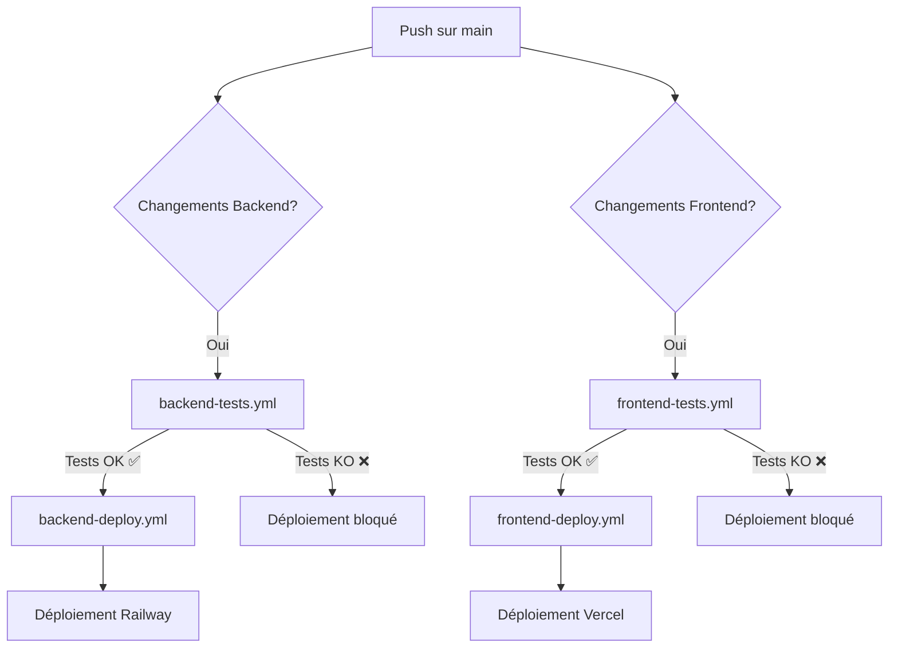

# GitHub Workflows - CI/CD Documentation

Ce dossier contient tous les workflows GitHub Actions pour l'automatisation des tests et des déploiements.

## 📋 Vue d'ensemble des Workflows

### 1. **ci.yml** - Tests Complets du Projet
- **Déclencheurs** : Push et Pull Request sur `main` et `develop`
- **Description** : Exécute tous les tests backend et frontend en parallèle
- **Jobs** :
  - `backend-tests` : 257 tests Python (89% coverage)
  - `frontend-tests` : 46 tests Jest
  - `summary` : Résumé des résultats (303 tests au total)
- **Durée estimée** : ~3-5 minutes

### 2. **backend-tests.yml** - Tests Backend Isolés
- **Déclencheurs** : Push/PR sur `main`/`develop` avec modifications dans `backend/`
- **Description** : Tests backend uniquement (optimisé)
- **Services** : PostgreSQL
- **Jobs** :
  - Tests unitaires (106 tests)
  - Tests d'intégration (151 tests)
  - Coverage upload vers Codecov
- **Durée estimée** : ~2-3 minutes

### 3. **frontend-tests.yml** - Tests Frontend Isolés
- **Déclencheurs** : Push/PR sur `main`/`develop` avec modifications dans `frontend/`
- **Description** : Tests frontend uniquement (optimisé)
- **Jobs** :
  - Linting ESLint
  - Tests unitaires (22 tests)
  - Tests d'intégration (24 tests)
  - Build Next.js
  - Coverage upload vers Codecov
- **Durée estimée** : ~2-3 minutes

### 4. **backend-deploy.yml** - Déploiement Backend
- **Déclencheurs** : Push sur `main` avec modifications dans `backend/`
- **Description** : Déploiement automatique vers Railway
- **Dépendances** : Tests backend doivent passer ✅
- **Jobs** :
  - `test` : Exécute tous les tests backend
  - `deploy` : Déploie sur Railway (seulement si tests passent)
- **Étapes de déploiement** :
  1. Exécution des tests complets
  2. Installation Railway CLI
  3. Déploiement du backend
  4. Exécution des migrations Alembic
- **Durée estimée** : ~5-7 minutes

### 5. **frontend-deploy.yml** - Déploiement Frontend
- **Déclencheurs** : Push sur `main` avec modifications dans `frontend/`
- **Description** : Déploiement automatique vers Vercel
- **Dépendances** : Tests frontend doivent passer ✅
- **Jobs** :
  - `test` : Exécute tous les tests frontend
  - `deploy` : Déploie sur Vercel (seulement si tests passent)
- **Étapes de déploiement** :
  1. Exécution des tests complets
  2. Installation Vercel CLI
  3. Pull des configurations Vercel
  4. Build de production
  5. Déploiement
- **Durée estimée** : ~4-6 minutes

## 🔐 Configuration des Secrets GitHub

Pour que les workflows de déploiement fonctionnent, vous devez configurer les secrets suivants dans GitHub :

### Accès GitHub Secrets
1. Aller sur votre dépôt GitHub
2. Cliquer sur **Settings** → **Secrets and variables** → **Actions**
3. Cliquer sur **New repository secret**

### Secrets Requis

#### Pour le déploiement Frontend (Vercel)

**VERCEL_TOKEN**
- Jeton d'accès Vercel pour l'authentification
- Obtention : https://vercel.com/account/tokens
- Créer un token avec les permissions de déploiement

**VERCEL_ORG_ID**
- Identifiant de votre organisation/compte Vercel
- Obtention :
  ```bash
  vercel login
  vercel link
  cat .vercel/project.json
  ```
- Copier la valeur de `"orgId"`

**VERCEL_PROJECT_ID**
- Identifiant du projet Vercel
- Obtention : Même commande que ci-dessus
- Copier la valeur de `"projectId"`

**NEXT_PUBLIC_API_URL_PROD**
- URL de votre API backend en production
- Exemple : `https://your-backend.railway.app`

#### Pour le déploiement Backend (Railway)

**RAILWAY_TOKEN**
- Jeton d'accès Railway pour l'authentification
- Obtention :
  ```bash
  railway login
  railway whoami
  ```
- Ou créer un token sur : https://railway.app/account/tokens

### Résumé des Secrets

| Secret | Service | Description |
|--------|---------|-------------|
| `VERCEL_TOKEN` | Vercel | Token d'authentification Vercel |
| `VERCEL_ORG_ID` | Vercel | ID de l'organisation Vercel |
| `VERCEL_PROJECT_ID` | Vercel | ID du projet Vercel |
| `NEXT_PUBLIC_API_URL_PROD` | Vercel | URL de l'API backend en production |
| `RAILWAY_TOKEN` | Railway | Token d'authentification Railway |

## 🚀 Workflow de Déploiement

### Processus Automatique



### Étapes du Processus

1. **Push sur `main`** avec modifications dans `backend/` ou `frontend/`
2. **Tests automatiques** s'exécutent immédiatement
3. **Si tests passent** ✅ :
   - Le job de déploiement démarre automatiquement
   - L'application est déployée en production
   - Un résumé est affiché dans GitHub
4. **Si tests échouent** ❌ :
   - Le déploiement est **bloqué** automatiquement
   - Aucun code bugué n'atteint la production
   - Les développeurs sont notifiés

## 📊 Statuts et Badges

### Ajouter des badges au README

```markdown


```

## 🧪 Tests Locaux avant Push

### Backend
```bash
cd backend
pytest tests/unit/          # Tests unitaires rapides
pytest tests/integration/   # Tests d'intégration
pytest tests/ --cov=app     # Tous les tests avec coverage
```

### Frontend
```bash
cd frontend
npm run test:unit           # Tests unitaires rapides
npm run test:integration    # Tests d'intégration
npm run test                # Tous les tests
npm run lint                # Vérifier le linting
npm run build               # Vérifier le build
```

## 🔧 Debugging des Workflows

### Voir les logs
1. Aller sur l'onglet **Actions** de votre dépôt
2. Sélectionner le workflow concerné
3. Cliquer sur le job qui a échoué
4. Examiner les logs détaillés

### Tester localement avec act
```bash
# Installer act (https://github.com/nektos/act)
brew install act  # macOS
# ou
sudo apt install act  # Linux

# Exécuter un workflow localement
act -j backend-tests
act -j frontend-tests
```

### Problèmes courants

**Tests qui passent localement mais échouent sur CI**
- Vérifier les variables d'environnement
- Vérifier les versions de Node.js/Python
- Vérifier les dépendances manquantes

**Déploiement qui échoue**
- Vérifier que tous les secrets sont configurés
- Vérifier les permissions des tokens
- Vérifier que les projets Vercel/Railway existent

## 📝 Bonnes Pratiques

### Pour les Développeurs

1. **Toujours tester localement** avant de push
   ```bash
   npm run test        # Frontend
   pytest tests/       # Backend
   ```

2. **Créer des Pull Requests** pour les nouvelles fonctionnalités
   - Les tests s'exécutent automatiquement sur les PR
   - Le merge est bloqué si les tests échouent

3. **Vérifier les workflows** avant de merger
   - Tous les checks doivent être verts ✅

4. **Ne pas skip les tests** en CI
   - Ne jamais utiliser `[skip ci]` pour contourner les tests

### Pour les Mainteneurs

1. **Protéger la branche `main`**
   - Settings → Branches → Branch protection rules
   - ✅ Require status checks to pass before merging
   - ✅ Require branches to be up to date before merging

2. **Activer les notifications**
   - Recevoir les notifications en cas d'échec de déploiement

3. **Monitorer les déploiements**
   - Vercel Dashboard : https://vercel.com/dashboard
   - Railway Dashboard : https://railway.app/dashboard

## 🔄 Mise à Jour des Workflows

Pour modifier un workflow :

1. Éditer le fichier `.github/workflows/*.yml`
2. Commit et push les modifications
3. Les workflows mis à jour s'appliquent immédiatement

## 📚 Ressources

- [GitHub Actions Documentation](https://docs.github.com/en/actions)
- [Vercel CLI Documentation](https://vercel.com/docs/cli)
- [Railway CLI Documentation](https://docs.railway.app/develop/cli)
- [Codecov Documentation](https://docs.codecov.com/)

## 🆘 Support

En cas de problème avec les workflows :
1. Vérifier les logs dans l'onglet Actions
2. Consulter cette documentation
3. Ouvrir une issue sur GitHub
